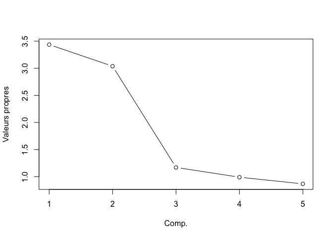
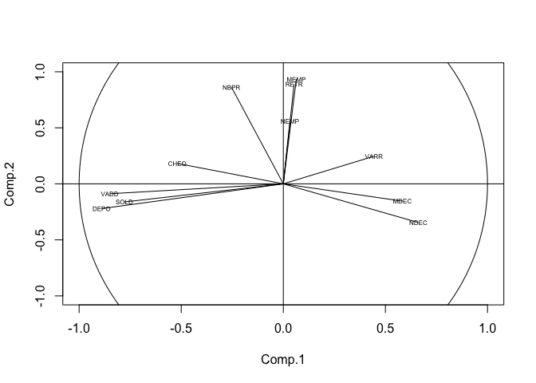
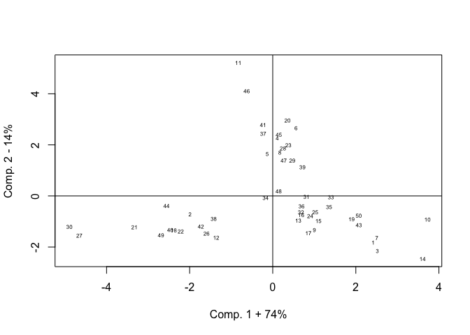
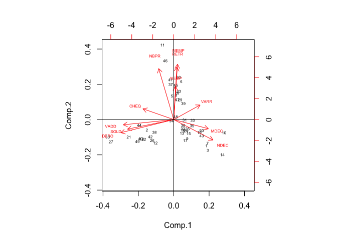

# Analyse de composantes principales avec R
#### Juin 2011


Introduction
------------

Ce tutoriel decrit le processus de realisation d'une ACP sur des donnees
de situation économique et de comportement bancaire de 50 clients d’une
banque. L'etude porte sur les parametres suivants :

-   SOLD : solde moyen du compte
-   CHEQ : montant moyen des chèques tirés au cours du dernier semestre
-   NDEC : nombre de mois avec découvert sur le compte courant lors de
    l’année précédente
-   MDEC : montant cumulé des découverts sur le compte courant lors de
    l’année précédente
-   NBPR : nombre de produits de la banque utilisés en plus du compte
    courant
-   NEMP : nombre d’emprunts divers effectués lors des cinq dernières
    années
-   MEMP : montant d’emprunts divers effectués lors des cinq dernières
    années
-   VADD : pourcentage de variation des dépôts d’épargne pour les 12
    derniers mois
-   DEPO : montant total des dépôts sur les comptes épargne lors de
    l’année précédente
-   RETR : montant total des retraits effectués sur les comptes épargne
    lors de l’année précédente
-   VARR : pourcentage de variation des retraits sur les comptes épargne
    pour les 12 derniers mois
-   TAIL : taille du ménage du client titulaire du compte courant
-   AGEC : âge du client titulaire du compte courant
-   activité : profession du client
-   TAILR : taille du ménage groupee en categories
-   AGECR : âge groupe en categories

Les données utilisées (<a href="bank.txt">bank</a>) sont une courtoisie du Cabinet STATS (Cotonou, Benin)


```{r}
require(data.table) ; require(magrittr);require(FactoMineR);require(plyr)
bank = fread("~/Documents/Pre-GitHub/acp/bank.txt", drop = 1) %>% data.table
bank$TAILR = car::recode(bank$TAIL, '1:3 = "1-3"; 3:5 = "3-5"; 5:10 = "5-10"; ', as.factor.result=TRUE) 
bank$AGECR = car::recode(bank$AGEC, '1:26 = "<27"; 27:36 = "27-36"; 37:44 = "37-44"; 45:53 = "45-53"; 54:100 = ">53";  ', as.factor.result=TRUE) 
head(bank)
```


Les variables pertinentes, directement liées à l’activité de la banque
sont dites *actives*. Il s'agit de : **SOLD CHEQ NDEC MDEC NBPR NEMP
MEMP VADD DEPO RETR** et **VARR**. Les variables **TAIL AGEC** et
**activité** sont considérées *illustratives*.

```{r}
bank.actif = bank[,c(1,2,3,5,6,7,9,10,11,13,14),with = F]
bank.illus = bank[,c(12,15,16),with=F]
```

calculer et afficher quelques statistiques descriptives
-------------------------------------------------------

```{r}
desc <- Reduce(rbind,list(sapply(bank.actif,min),sapply(bank.actif,max),sapply(bank.actif,mean),sapply(bank.actif,median),sapply(bank.actif,sd),sapply(bank.actif,sd)^2))
rownames(desc) <- c("Minimum","Maximum","Moyenne","Mediane","Ecart-type","Variance")
desc
```


acp normée
----------

```{r}
acp.actif <- princomp(bank.actif, cor = TRUE, score = TRUE)
summary (acp.actif)
```

'cor = TRUE' précise que les données doivent être centrées et réduites, afin d’avoir une ACP normée.
'score = TRUE' commande le calcul des coordonnées factorielles.

-   *Standard deviation* (Ecart-types) indiquent les racines carré des
    valeurs propres associées.
-   *Proportion of variance* (Taux de variance) permet d’apprécier la
    quantité (%) d’information apportée par chacun des axes.
-   *Cumulative proportion* (Variance cumulee) ; on peut observer par
    exemple que les 02 premiers axes apportent 58,85 % de l’information.

valeurs propres
---------------

Carrés respectifs des écarts-type associés aux différents axes.
Considerons les 5 premiers axes

```{r}
val.p <- acp.actif$sdev[1:5]^2
val.p %>% round(.,2)
val.p
```


intervalle \[de confiance\] laplacien d'anderson (5%)
-----------------------------------------------------

Ces intervalles permettent d’apprécier la qualité de l’échantillon
retenu pour l’étude. Il s’agit de vérifier si pour les composantes
retenues, les valeurs propres associées sont plus ou moins bien centrées
dans leur intervalle de confiance. Dans le cas contraire, un
reéchantillonnage peut permettre de réduire les intervalles.

```{r}
n <- acp.actif$n.obs
inf <- val.p * exp(-1.96 * sqrt(2.0/(n-1)))
max <- val.p * exp(+1.96 * sqrt(2.0/(n-1)))
int.conf.val.p <- cbind (inf, val.p, max)
colnames(int.conf.val.p) <- c("Borne Inf.", "Valeurs propres", "Borne Sup.")
int.conf.val.p %>% round(.,2)
```


histogramme des 5 premieres valeurs propres
-------------------------------------------
```{r}
plot(1:5, val.p, type="b", ylab="Valeurs propres", xlab="Comp.")
```


Les sommets ont été joints afin d’illustrer la chute lors du passage
d’une valeur propre à une autre. Selon **« la règle du coude »**, les
axes retenus pour l’analyse sont ceux avant lesquels la chute devient
brusque, avec une pente très raide. Ici nous retiendrons les deux
premiers. Un autre critère, la **règle de Kaiser** suggere de retenir
plutôt les axes pour lesquels les valeurs propres associés sont
supérieures à 1. Les coordonnées calculées ci-dessus nous permettrons
d’apprécier la proximité des variables par rapport au cercle de
corrélation. Nous retiendrons donc pour l’analyse des composantes
principales, les variables qui auraient les coordonnées les plus élevées
en valeur absolue pour un axe et pour l’autre. Nous pouvons observer que
les variables **SOLD VADD DEPO** sont les plus pertinentes par rapport à
l’axe 1, et les variables **RETR MEMP NBPR** pour l’axe 2. Le signe des
coordonnées précise le côté duquel se trouve la variable (côté positif
pour (+) et négatif pour (-).

matrice de correlation des variables actives
--------------------------------------------
```{r}
cor(bank.actif) %>% round(.,2)
```


coordonnees des variables sur les 5 premiers axes
-------------------------------------------------
```{r}
coord.var <- apply(acp.actif$loadings,1,function(x){x*acp.actif$sdev}) %>% t
coord.var [,1:5] %>% round(.,2)
```


Pour interpréter le nuage des variables, nous devons rechercher 02
choses. La proximité des variables par rapport à chacun des 02 axes que
nous avons retenu et à la proximité des variables par rapport au cercle
de corrélation. Les variables les plus proches d’un axe et du cercle
sont les mieux représentées sur cet axe et deviennent utile à
l’interprétation.

cosinus carre des variables sur les 5 premiers axes
---------------------------------------------------
```{r}
cos.var <- coord.var^2
```
Les cosinus carré calculés ci-dessus nous permettrons d’apprécier la
proximité des variables par rapport à chacun des axes factoriels. Plus
grand est le cosinus carré d’une variable, plus proche elle est de l’axe
factoriel associé. nous allons retenir pour l’analyse, les variables qui
auraient les cosinus carré les plus grands respectivement pour nos 02
composantes. Nous pouvons observer que les variables **SOLD VADD DEPO**
sont les plus près de l’axe 1 et les variables **RETR MEMP NBPR** les
plus près de l’axe 2.

contribution des variables a l'inertie des 5 premiers axes
----------------------------------------------------------
```{r}
contrib.var = apply(cos.var[,1:5],1,function(x){x / val.p}) %>% t
contrib.var [,1:5] %>% round(.,2)
```

nuages des variables
--------------------
```{r, fig.keep='last'}
plot(coord.var[,1:2],xlim=c(-1,+1),ylim=c(-1,+1),type = "n") +
symbols(0,0,circles=1,inches=F,add=T) +
abline(h=0,v=0) +
text(coord.var[,1],coord.var[,2],labels=colnames(bank.actif),cex=0.5) +
segments(x0=0,y0=0,coord.var[,1],coord.var[,2])
```


Ce nuage reste cependant incomplet pour l'analyse, dans les positions
des individus.

coordonnees des individus avec les 5 premieres composantes
----------------------------------------------------------
```{r}
coord.ind <- acp.actif$scores[,1:5]
head(coord.ind)
```


calcul des disto des individus
------------------------------
```{r}
disto.ind <- colSums(apply(bank.actif,1,function(x){ ((x-acp.actif$center)/acp.actif$scale)^2}))
head(disto.ind)
```


Le disto traduit l’éloignement de l’individu par rapport à l’origine du
repère. Les individus les plus éloignés (disto plus grands) sont
considérés atypiques.

calcul des cosinus carre des individus
======================================
```{r}
cos.ind <- apply(acp.actif$scores,2,function(x){(x^2)/disto.ind})
head(cos.ind) %>% round(.,2)
```


Le cosinus carré traduit la proximité à l’axe factoriel associé. un
individu bien représenté est aussi proche que possible de l’axe.

contributions des individus a la formation des 5 premieres composantes
----------------------------------------------------------------------
```{r}
contrib.ind <- apply(coord.ind,1,function(x){(x^2)/val.p})
```
La contribution résume les deux informations précédentes. Elle révèle
ceux qui contribue le mieux à la formation de l’axe associé.

nuage des individus
-------------------
```{r, fig.keep='last'}
plot(acp.actif$scores[,1:2],type="n",xlab="Comp. 1 + 74%", ylab="Comp. 2 - 14%") +
abline(h=0,v=0) +
text(acp.actif$scores[,1],acp.actif$scores[,2],labels=rownames(bank.actif),cex=0.5)
```
#

nuage individus x variables
---------------------------

Le graphe precedent est enrichi du nuage des variables et d'indicateurs
directionnels des groupements dindividus
```{r, fig.keep='last'}
biplot(acp.actif, cex=0.5) +
abline(h=0,v=0)
```
#

On notera essentiellement que les 02 axes parviennet a discriminer entre
3 groupes dindividus. LACP aura permis d'illustrer comment nos variables
opposent des groupes dindividus caracteristiques.
